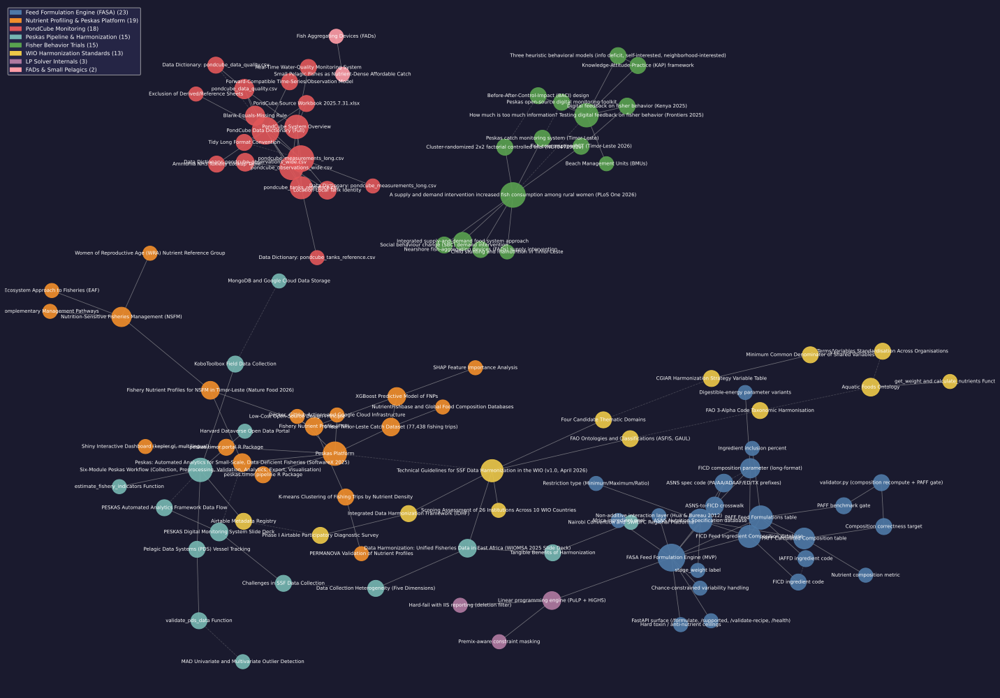
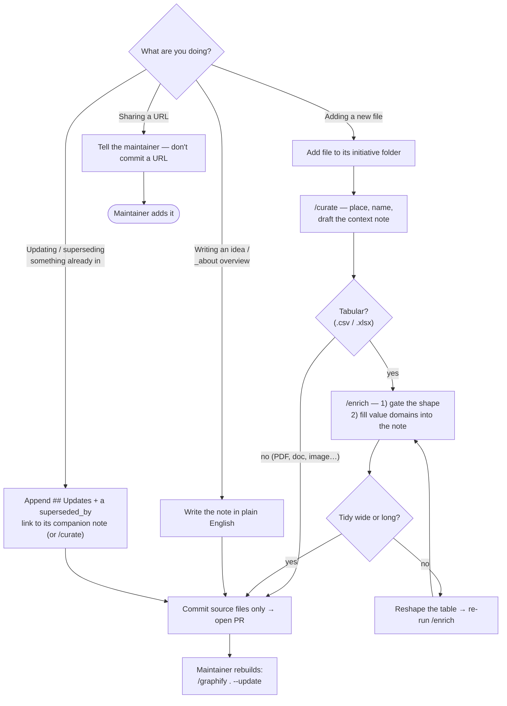

# WDB — WorldFish Digital Brain

 · [CHANGELOG](CHANGELOG.md)

A shared Graphify knowledge graph for the WorldFish Digital Brain (WDB). This README is the **practical
guide** to adding material; the complete, authoritative rules live in **[PROTOCOL.md](PROTOCOL.md)** —
when in doubt, that file wins.

> **📐 Full rules:** [PROTOCOL.md](PROTOCOL.md) is the single source of truth (placement, naming, tidy
> data, context notes, supersession, build/maintainer reference). This README states each rule briefly
> and links into it.
>
> **🧑‍💻 Not a coder?** [USER_GUIDE.md](USER_GUIDE.md) is this same protocol, click by click, with
> screenshots.

### 🧠 The knowledge graph

[](graphify-out/GRAPH_REPORT.md)

*The current graph, each colour a community. Click for the readable **[GRAPH_REPORT.md](graphify-out/GRAPH_REPORT.md)**.* **Interactive version:** clone the repo and open **`graphify-out/graph.html`** in any browser (GitHub serves `.html` as raw source, so the live graph is local-only).

## What this is

Graphify points at a folder and builds a queryable knowledge graph instead of grepping files. A build
produces, in `graphify-out/`: `graph.html` (interactive), `GRAPH_REPORT.md` (key concepts + suggested
questions), and `graph.json` (the full graph). Code is parsed locally; docs/PDFs/images go to the
model for semantic extraction; relationships are tagged `EXTRACTED`/`INFERRED`/`AMBIGUOUS`. It is *not*
filename matching — it connects what your files make **explicit** (see [PROTOCOL §8](PROTOCOL.md#8-how-graphify-extraction-works)).

**Who runs what.** Contributors self-check with **`/curate`** (placement, naming, context note) and
**`/enrich`** (table shape + value domains) before opening a PR. **Only the maintainer runs the build
(`/graphify`)** and commits `graphify-out/`. One build owner keeps the shared map conflict-free
([PROTOCOL §1](PROTOCOL.md#1-roles-and-the-single-builder-rule)). This repo runs on **Claude Code**.

## Add something — the protocol in 7 steps

Full detail for each step is in [PROTOCOL §2](PROTOCOL.md#2-the-contribution-protocol).

1. **Sync & branch** — pull `main`, branch `yourname/short-topic`.
2. **Pick the initiative folder** — group by initiative, not file type ([§3](PROTOCOL.md#3-project-first-placement)). Unsure? **Ask the maintainer.**
3. **Add the file, named by the rule** — `lower_snake_case`, descriptive, year/region when they apply ([§4](PROTOCOL.md#4-naming)). Tables must be **tidy** — one header row, wide or long ([§5](PROTOCOL.md#5-tidy-data)).
4. **Write its context note** — required for every dataset/PDF/document. Run **`/curate`** to draft it; name it by replacing the extension with `_dict.md` (tables) or `_context.md` (else). Fill every section — especially **Related files** ([§6](PROTOCOL.md#6-context-notes)).
5. **Validate tables with `/enrich`** — gates the shape and fills the `## Columns` value domains.
6. **Commit source files only** (never `graphify-out/`), then open a **pull request**.
7. **Maintainer rebuilds** — `/graphify . --update` after merge. *(Contributors never build.)*

The map below covers every path: adding a file, writing a note, sharing a link, or updating/superseding something already in ([§7](PROTOCOL.md#7-recording-updates-and-supersession-over-time)).



### What am I adding?

| What you're adding | Context note |
|---|---|
| Dataset / spreadsheet (`.csv`, `.xlsx`) | **Required** — Template A (`…_dict.md`); run **`/enrich`** |
| Report / paper / document (`.pdf`, `.docx`, `.md`, `.txt`) | **Required** — Template B (`…_context.md`) |
| Image / diagram / audio / video | Required if it carries information — Template B |
| External link / online paper / repo | Don't save a URL — tell the maintainer (`/graphify add <url>`) |
| A topic / whole-initiative overview | Standalone `_about.md` — the **living current-state node** ([§6](PROTOCOL.md#6-context-notes)) |
| An idea / observation | The note *is* the content: `idea_<topic>.md` |

### Context notes — the quality lever

Each note turns a lone file into a connected node; **`## Related files`** is where you hand the graph
its edges (list real siblings and **cross-link across initiatives**). Copy the **canonical templates +
worked examples** from [PROTOCOL §6](PROTOCOL.md#6-context-notes). Skeletons:

```markdown
# Data dictionary: <file>.csv        |   # Context: <file>.pdf
## Summary                           |   ## Summary
## Columns   (value domains: /enrich)|   ## Key concepts / entities
## Related files                     |   ## Related files
## Notes / caveats                   |   (## Updates — only when superseded; see §7)
```

Keep a table's **shape** (wide/long) and any **tooling/provenance** *out* of the note — that's habit 4,
and it's why the graph stays clean ([§6](PROTOCOL.md#6-context-notes)).

### Updating something already in the brain

Notes are **frozen snapshots** of when a file was added — so when knowledge changes you **append**, you
don't rewrite. The current state of an evolving project lives in its **living `<initiative>_about.md`**
(kept up to date in place). On a now-dated note, add a `## Updates` line and point `## Related files` at
the current version with `superseded_by`. A **rough or relational date is fine** ("~2026", "since the
2025 paper") — never invent one. Tell **`/curate`** what changed and it makes the edits. Full spec:
[PROTOCOL §7](PROTOCOL.md#7-recording-updates-and-supersession-over-time).

### Before you open the PR

- [ ] Correct **initiative folder**; **`lower_snake_case`** descriptive name
- [ ] Ran **`/curate`**; tables are **tidy** and passed **`/enrich`**
- [ ] **Context note** present, every section filled; **Related files** lists real siblings (+ a cross-initiative link)
- [ ] Only **source files** staged (nothing under `graphify-out/`); on **my branch**, opening a **PR**

## Setup (one-time, each team member)

Install **Claude Code** (VS Code extension, desktop app, or CLI) and Graphify so you can run `/curate`
and `/enrich`. You will **not** build the graph.

```bash
uv tool install graphifyy     # recommended (or: pipx install graphifyy / pip install graphifyy)
graphify install              # register the /curate and /enrich skills with Claude Code
```

Optional extras by file type: `graphifyy[pdf]`, `graphifyy[office]` (`.docx`/`.xlsx`),
`graphifyy[video]`, or `graphifyy[all]`. (Non-coders: [USER_GUIDE.md](USER_GUIDE.md) walks this through
click by click. Windows/PowerShell: drop the leading `/` where your shell needs it.)

## For maintainers

Building, model pinning + provenance (`BUILD_INFO.md`), git hygiene, `.graphifyignore`, external
sources, and the reference layout are all in
[PROTOCOL §9–10](PROTOCOL.md#9-maintainer-and-build-reference). Operator rules for the build itself
(model pin, the format-blind extraction guard, standard vs `--mode deep`) live in
[CLAUDE.md](CLAUDE.md).

---

Graphify is open-source (MIT): **[graphifylabs.ai](https://graphifylabs.ai/)** · source & issues:
**[github.com/safishamsi/graphify](https://github.com/safishamsi/graphify)** · PyPI: `graphifyy`.
