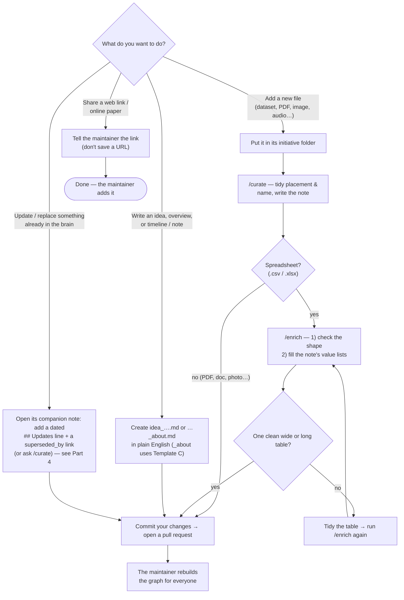

# Adding things to the WDB graph — a guide for non-coders

 · [CHANGELOG](CHANGELOG.md)

This guide is for team members who have **never used a code editor** and don't write code. It walks you, click by click, through adding something new — a dataset, a PDF, a photo, even just an **idea** — to the WorldFish Digital Brain (WDB) so it becomes part of the shared knowledge graph.

**This is the exact same procedure as the [main protocol](PROTOCOL.md#2-the-contribution-protocol) — just with screenshots.** Following the same steps as everyone else is what keeps the brain consistent. You never touch the main project directly: you make your changes on your **own copy**, and the maintainer reviews and approves them. *(The complete rules live in [PROTOCOL.md](PROTOCOL.md); you don't need to read it — this guide covers everything you do.)*

You **do not build the graph** — the maintainer does that after approving your change. You do run **two simple check commands** on your own file before you submit (`/curate` and `/enrich`); you type them into the assistant's chat box, which is not coding. Setup below gets you ready for that (do it once).

**A few words you'll see (in plain English):**
- **Repo / repository** — the project's shared folder on GitHub. For us it's called **WDB**.
- **Clone** — download a copy of the repo onto your laptop so you can add things.
- **Branch** — your own private workspace inside the repo where you make changes without affecting everyone else.
- **Commit** — save a snapshot of your change, with a short note describing it.
- **Push / Publish** — send your saved change up to GitHub.
- **Pull request (PR)** — a request asking the maintainer to review your change and add it to the main project.
- **Pull** — get the latest version of the project onto your laptop.
- **Assistant** — **Claude Code**, the AI helper you add to your editor. WDB's check commands (`/curate`, `/enrich`) are Claude Code features, so it has to be Claude Code. You type **slash commands** like `/curate` into its chat box.

> ## ⚠️ The golden rule
> **Never add your files to the main project directly.** Always work on **your own branch** and open a **pull request**. The maintainer reviews every pull request and approves it — that's how your work gets into WDB. The steps below do this for you; just follow them in order.

---

## Part 1 — One-time setup (do this once)

Do this with a colleague nearby the first time if you can. After it's done, you never repeat it. **You will not build the graph** — but you do install the assistant and two check commands so you can tidy your own file before submitting.

**1. Get access to the repo.**
Ask the WDB maintainer to invite your GitHub username to the repo. You'll get an email invitation — click the link and accept it.

**2. Install VS Code + Claude Code.** WDB's check commands (`/curate`, `/enrich`) are **Claude Code** features, so you need Claude Code specifically:
- Install **VS Code** — https://code.visualstudio.com — like a normal app, and open it.
- In its **Extensions** panel (left sidebar), search **Claude Code**, install it, and sign in when prompted.

*(Claude Code also comes as a desktop app and a command-line tool; the VS Code extension is the simplest for this guide.)*

**3. Install Git.**
The editor needs a tool called Git to talk to GitHub. Get it from https://git-scm.com (on a Mac it's often already there). Install it, then restart the editor.

**4. Sign in to GitHub inside the editor.**
Find the **Accounts** icon (a little person, usually bottom-left), click it, and sign in to GitHub.

**5. Install the two check commands (`/curate` and `/enrich`).**
Open the editor's **Terminal** (top menu → **Terminal → New Terminal**) and paste these two lines, pressing Enter after each:

```bash
uv tool install graphifyy
graphify install
```

*(If the first line says `uv: command not found`, install `uv` from https://docs.astral.sh/uv first, or ask a colleague — it's a one-time copy-paste.)* This is the only time you touch the terminal. From now on you'll use the assistant's **chat box**, not the terminal.

**6. Download (clone) the repo.**
- Press **Ctrl+Shift+P** (Mac: **Cmd+Shift+P**) to open the **Command Palette** — a search box at the top.
- Type **Git: Clone** and select it.
- Paste the WDB repo address (ask the maintainer; it looks like `https://github.com/your-org/WDB.git`).
- Choose a folder on your laptop (e.g. Documents), then click **Open** when prompted.

You'll now see the WDB folders in the **left sidebar** (the Explorer). That's the repo.

---

## Part 2 — The protocol, step by step

These are the **same steps as the [main protocol](PROTOCOL.md#2-the-contribution-protocol)** — you perform steps 1–6 below by clicking and typing two commands; step 7 (rebuilding the graph) is the maintainer's. Repeat them every time you add something.

**The two commands run in order: `/curate` first, then `/enrich`.** `/curate` (Step 4) tidies your file and writes its note; `/enrich` (Step 5) runs **after** it and **only for spreadsheets**, to check the table's shape and fill in the note's value lists. So always do `/curate` first — and if your file isn't a spreadsheet, you only need `/curate`. The map below shows **every path you might take** — adding a file, writing a note, sharing a link, or **updating something that's already in** (that last one is [Part 4](#part-4--updating-something-thats-already-in-the-brain)):



**Step 1 — Sync & branch.**
- Click the **Source Control** icon on the left (a branching-road shape) → the **"⋯"** menu at the top → **Pull**. Now you have the newest version.
- Look at the **bottom-left corner** — it shows the current branch (probably `main`). Click it → **Create new branch** → name it `yourname/short-topic` (e.g. `maria/kenya-yield-data`). Press Enter. *(This is the golden rule in action — you're now on your own branch.)*

**Step 2 — Pick the initiative folder.**
In the **left sidebar (Explorer)**, open **`knowledge_base/`** — everything that goes into the brain
lives in there (the other top-level folders are the software that reads it, not content). Inside it,
open the folder for the initiative your item belongs to (e.g. `project_kenya_pilot/`). We organize **by initiative, not by file type** — everything for one effort lives together. If no folder fits, right-click the empty Explorer space → **New Folder** and name it in `lower_snake_case` (e.g. `genetic_improvement`). **If you're unsure which initiative it belongs to, ask the maintainer — don't guess.**

**Step 3 — Add the file, named by the rule.**
Drag your file into that folder, then rename it (right-click → **Rename**) to follow the rule: **`lower_snake_case`, descriptive, with year/region when they apply** — `kenya_yield_2025.csv`, not `data.csv` or `Final Report.pdf`. Don't change a spreadsheet's column headers; keep a published paper's real title. *(See [Part 3](#part-3--what-you-can-add) for each file type.)*

> **Spreadsheets must be one clean table.** A single row of column headings at the very top, then only data rows underneath — **no** merged cells, **no** title or notes rows above the headings, **no** second table further down the sheet, **no** pivot tables. It must be one of two shapes: **wide** (one row per thing — e.g. per site/date — and one column per measurement) or **long** (a column that names the measurement plus a column holding its value). If your sheet isn't like this, tidy it into one clean table before adding it. Step 5's `/enrich` check confirms the shape and tells you exactly what to fix.

**Step 4 — Write its context note (the `/curate` way).** *(Required for datasets, PDFs, and documents.)*
This small note is what lets the graph connect your file. The easy way:
- Open the **Claude Code panel** in your editor and type **`/curate`** in its chat box. It reads your new file and drafts the note for you — correct name, the right template, and the all-important **`## Related files`** links.
- **Read what it wrote** and fix anything it got wrong (you know the file best). Save (**Ctrl+S** / **Cmd+S**).

Prefer to write it by hand? Right-click the folder → **New File**, name it your file's name with its **extension replaced** by `_dict.md` (spreadsheets) or `_context.md` (everything else) — e.g. `kenya_yield_2025.csv` → `kenya_yield_2025_dict.md`. Copy the matching template from **[PROTOCOL.md — Context notes](PROTOCOL.md#6-context-notes)** and fill **every** section. The most important line is **`## Related files`**: list the real files yours relates to — including files in **other initiative folders**. Those cross-links are what make the brain valuable.

**Step 5 — Check a spreadsheet with `/enrich`.** *(Skip if you didn't add a `.csv`/`.xlsx`.)* Do this **after** Step 4 — `/enrich` fills the note that `/curate` just wrote.
In the assistant chat, type **`/enrich`** followed by your file name (e.g. `/enrich kenya_yield_2025.csv`). It does two things:
- **Checks the shape.** If the table isn't one clean wide/long table, it **stops and tells you exactly what to fix** — go back to Step 3, tidy it, and run `/enrich` again.
- **Fills the value lists** in your `_dict.md` automatically (the maintainer reviews them later).

**Step 6 — Commit (source files only), then open a pull request.**
- Click the **Source Control** icon. **Don't include anything from `graphify-out/`** — that folder is generated automatically. In the message box, type a short description, e.g. *"Add Kenya 2025 yield dataset + context note."* Click **Commit** (if asked to stage all changes, click **Yes**).
- Click **Publish Branch** (or **Sync Changes**). This uploads *your branch* — not the main project.
- Go to **github.com**, open the WDB repo. You'll see a banner: **"Compare & pull request"** — click it. (Or **Pull requests** tab → **New pull request**.) Add a one-line title and a sentence saying what you added, then click **Create pull request**.

**Then: wait for approval.** The maintainer reviews your pull request, may ask for a small change, then merges it. After merging, they refresh the graph for everyone. **You're done — no graph to build.**

---

## Before you open the PR — checklist

This is the same checklist the README uses. Tick every box:

- [ ] File is in the correct **initiative folder**
- [ ] Name is **`lower_snake_case`**, descriptive (year/region if relevant)
- [ ] Ran **`/curate`** — it tidied the placement, name, and context note
- [ ] A spreadsheet is **one clean table** (wide or long) and **passed `/enrich`**
- [ ] **Context note** present where required, with **every section filled in**
- [ ] **Related files** lists real siblings (+ a cross-initiative link where one exists)
- [ ] Only **source files** committed — nothing from `graphify-out/`
- [ ] You're on **your branch**, opening a **pull request** — not committing to `main`

---

## Part 3 — What you can add

Put it in the right **initiative folder**, give it a **`lower_snake_case`** name, and add the context note the table requires (templates + worked examples are in **[PROTOCOL.md — Context notes](PROTOCOL.md#6-context-notes)**). This table matches the "What am I adding?" list exactly.

| What you're adding | How to add it | Context note |
|---|---|---|
| **Dataset / spreadsheet** (CSV, Excel) | Drag into the folder. Don't change the column headers. Make it **one clean table** — single header row, **wide or long** (see Step 3). | **Required** — [Template A](PROTOCOL.md#template-a--tabular-data-csv-xlsx) (`…_dict.md`); run **`/enrich`** yourself to check the shape and fill its value lists (maintainer reviews). |
| **Report / paper / document** (PDF, Word, text) | Drag it in. Keep a published paper's real title. | **Required** — [Template B](PROTOCOL.md#template-b--everything-else-pdfs-docs-images-audiovideo) (`…_context.md`). |
| **Image / photo / diagram / screenshot** | Drag it in (e.g. a whiteboard photo or field map). | Required if it carries information — Template B (`…_context.md`). |
| **Meeting recording / audio** (MP4, MP3) | Drag the media file in; the maintainer's tools transcribe it. | Required if it's hard to follow — Template B (`…_context.md`). |
| **Web link / online paper** | **Don't** paste a URL into a file. Tell the maintainer the link — they add it properly with `/graphify add`. | The maintainer adds it. |
| **A topic / initiative overview** (not about one file) | Right-click the folder → **New File** → name it `<topic>_about.md` (e.g. `pondcube_about.md`) and write a short overview. | Follow the light **`_about.md` template** ([Template C](PROTOCOL.md#template-c--initiative-overview-_aboutmd)) — a title, one line on what it is, and a `## Related files` list. If it's part of a bigger initiative, point up to that initiative's `_about.md` so the two link. **`/curate` sets this up for you.** |
| **A project's timeline, history, or notes** | Right-click the folder → **New File** → name it `<project>_<topic>_about.md` (e.g. `peskas_timeline_about.md`) and write it. | A **child** of the project's `_about.md` ([satellite rules](PROTOCOL.md#initiative-perspective-docs-satellites--the-canonical-name)): always call the project by **the same name** its `_about.md` uses, and point up to that `_about.md`. **`/curate` sets this up for you.** |
| **An idea, note, or observation** | Right-click the folder → **New File** → name it `idea_<short-topic>.md` and write it in plain English. | The note *is* the content — name any related files/initiatives inside it so the graph links them. |

---

## Part 4 — Updating something that's already in the brain

Sometimes a file is already in the brain, but the world moves on: a 2025 report's method gets replaced, or a project quietly changes how it works. **You don't delete or rewrite the old thing** — it's still a true record of its moment, and other notes point to it. You just **add a short note on top** so the brain knows what changed.

**The golden rule for updates: never change the original file, and don't rewrite its note. Only *add* to it.**

**Where "what's true now" lives — the project overview.** Most projects keep one living summary file named like `peskas_about.md` (the project's name + `_about`). Unlike everything else, **that one file is *meant* to be kept up to date** — it describes the project *as it is today*. So when an older file goes out of date, the thing that "replaces" it is usually **the project's `_about.md`**, not a brand-new document. If the project doesn't have one yet, `/curate` will offer to make one.

Here's how, in two small additions to the old file's **companion note** (the `..._context.md` or `..._dict.md` next to it):

1. **Say what changed.** Open the companion note, scroll to the bottom, add an **`## Updates`** heading (if it isn't there) and one line — newest at the top:

   ```
   ## Updates
   - **2026 (around then)** — The workflow changed; the part in section 3 is now
     replaced (superseded_by) the current project summary `peskas_about.md`.
     The 2025 numbers above are still correct for 2025.
   ```

   **A rough date is fine** — *"2026"*, *"around 2026"*, *"since the 2025 paper"*, even *"not sure exactly when"*. **Don't guess a precise date you don't know.** What matters is recording *that* it changed and *what* now replaces it.

2. **Link it to what's current.** In that same note's **`## Related files`** list, add a line pointing at the current version (usually the project overview):

   ```
   ## Related files
   - peskas_about.md — superseded_by
   ```

   That link is what lets the brain tell *current* from *out-of-date*. (If a specific newer file — not the overview — is what replaced it, point at that file instead, and add the mirror line `old_file.pdf — supersedes` in the newer file's note.)

**The easy way:** type **`/curate`** in the assistant chat and tell it *"the workflow in the 2025 paper has been superseded by current Peskas"* — it writes both bits in the right place, and offers to create the project overview if there isn't one. Read what it wrote, save, and open a pull request as usual. *(Don't put any of this in the little `---` block at the very top of a note — the brain ignores update info there. It has to be in the body, as shown above.)*

---

## Quick reference

| You want to… | Do this |
|---|---|
| Open the Command Palette | **Ctrl+Shift+P** (Mac: **Cmd+Shift+P**) |
| Get the latest version | **Source Control → ⋯ → Pull** |
| Start your own branch | Click the branch name (**bottom-left**) → **Create new branch** |
| Draft a context note | Type **`/curate`** in the assistant chat |
| Check a spreadsheet | Type **`/enrich <file.csv>`** in the assistant chat |
| Mark something as updated/superseded | Add a dated `## Updates` line + a `superseded_by` link to its note (or ask **`/curate`**) — [Part 4](#part-4--updating-something-thats-already-in-the-brain) |
| Save your work | **Source Control →** type a message **→ Commit** |
| Send it for review | **Publish Branch**, then open a **Pull request** on github.com |

> **Browser-only fallback (no editor):** You can add files straight on **github.com → WDB → the right initiative folder → "Add file" → "Upload files"** (or "Create new file" for an idea); at the bottom choose **"Create a new branch for this commit and start a pull request"** → **Propose changes**. This keeps the golden rule — but you **can't run `/curate` or `/enrich` there**, so say in your PR that the table still needs checking, and the maintainer will run them before merging.

## If something goes wrong
- **Don't edit or delete anything inside the `graphify-out/` folder** — that's generated automatically.
- If `/curate` or `/enrich` doesn't respond, check Part 1 Step 5 ran without errors (re-open the Terminal and run the two lines again).
- If you don't see **Create new branch**, you may have skipped signing in (Part 1, Step 4).
- Always check the **bottom-left** shows *your* branch, not `main`, before you commit.
- Still stuck? Send the maintainer: (1) which step you're on, (2) the exact error wording, and (3) a screenshot. That's enough to help quickly.
